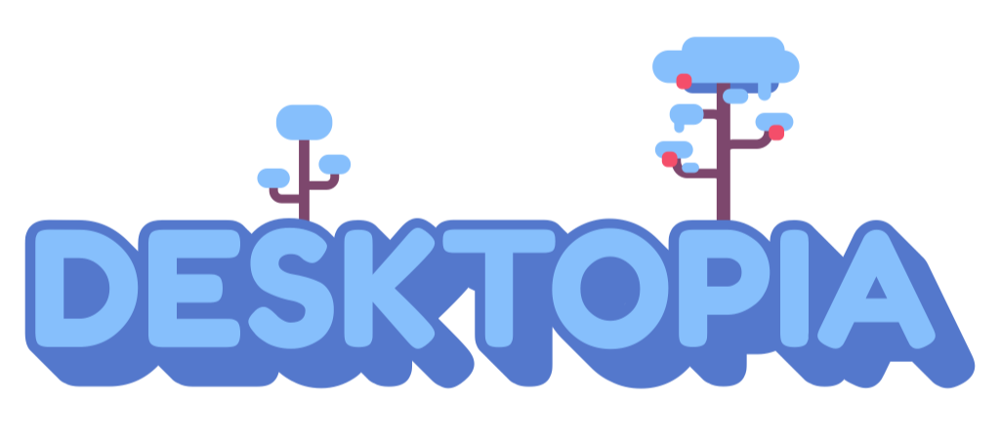

### Desktopia is a library that helps you to easily build Windows desktop games and experiences in Unity.

#### [Forum](https://unnamedcollective.itch.io/desktopia/community) - [Twitter](https://twitter.com/screenshakes) - [Discord](https://discord.gg/CkwAZKM)

  

  
**Getting started**
------------

Try one of the example scenes or drop the [Desktopia] prefab into one your scene and check the features you want to try out.  
Be aware that enabling window modifiers while testing in the editor will result into weird behaviours and it is recommended to try those in a build.
  
**If your transparent window does not work:**  
Got to to Project Settings > Resolution and Presentation  
Uncheck "Use DXGI Flip Model Swapchain for D3D11" 

  

**Features**
------------

### **Windows**

_Used to modify the properties of any window._

*   Transparent window
*   Click through window
*   Top most window
*   Minimize / Maximize window
*   Focus window
*   Set window position
*   Set window size
*   Set window title
*   Send text to the window
*   Send key input to the window

### **Inputs**

_Used to listen to system-wide inputs._

*   Get key down / pressed / up
*   Get mouse button down / pressed / up
*   Add on key down / up callback
*   Add on mouse button down / up callback
*   Add on mouse move callback

### **Cursor**

_Used to modify the position of the cursor._

### **Colliders**

_Used to have screen space collision between objects and the opened windows._

### **File Drag and Drop**

_Used to add callbacks that get invoked when a user drops a file into the window._